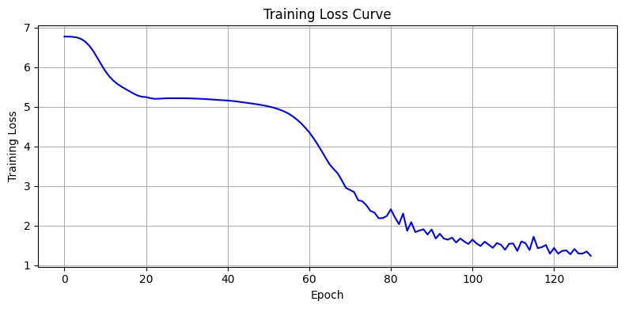
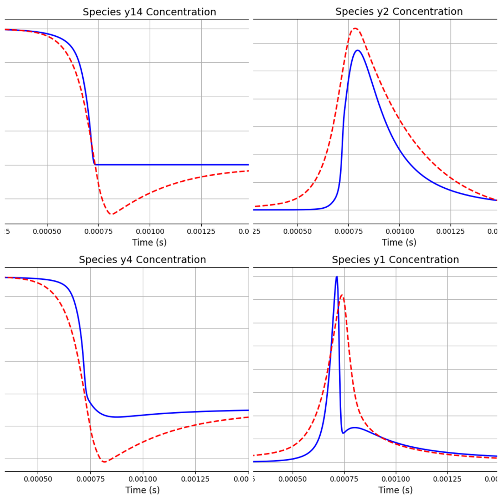
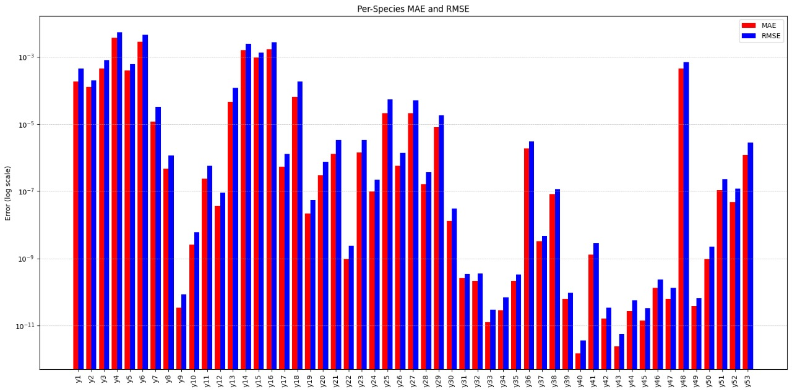

# MethanODE : A Unified Neural ODE for Methane Combustion Kinetics

This repository presents **MethanODE**, a deep learning model based on **Neural Ordinary Differential Equations (Neural ODEs)** designed to simulate the evolution of **53 chemical species** and **temperature** in **CH₄/Air combustion**.

Developed as part of Siemens' Industrial AI assignment by  
**Abhiudai Shahi (BT22CSD040)**  
**IIIT Nagpur | June 2025**

---

##  Model Architecture

MethanODE consists of a shared encoder-decoder Neural ODE that models all species and temperature jointly as a coupled dynamical system. This approach allows the network to learn inter-species interactions more effectively than the traditional ChemNODE sequential training.

        •	A shared encoder-decoder model built using Neural ODEs
        •	53 species + temperature modeled as a coupled ODE system
        •	Each output channel corresponds to a species or temperature prediction

---

## 📈 Visualizations

###  Training Dynamics

  

---

###  Temperature Prediction 

  

---

###  Specie-wise Analysis ( Avg MAE: 2.37e-04 )

#### Actual vs Predicted Concentration of a Specie

  

#### Derivative Comparison

  

#### Per-Specie RMSE and MAE (Log-scaled)

  

---

## 📊 Evaluation: MethanODE vs ChemNODE

### Table 1: Concentration Prediction – ChemNODE vs MethanODE  
(Assuming y1 = H₂, y2 = O₂, etc.)

| Quantity      | Species | ChemNODE AMAE | MethanODE MAE | Remarks                     |
|---------------|---------|----------------|----------------|-----------------------------|
| Temperature   | T       | 7.14×10⁻⁴      | **0.1**        | Comparable relative error   |
| Concentration | H₂ (y1) | 4.72×10⁻³      | 2.57×10⁻⁴      | Significantly lower error   |
| Concentration | O₂ (y2) | 2.18×10⁻³      | 1.85×10⁻⁴      | Better than ChemNODE        |
| Concentration | O (y4)  | 9.14×10⁻³      | 4.36×10⁻³      | Slightly higher             |
| Concentration | OH (y14)| 8.51×10⁻³      | 1.69×10⁻³      | Much better than ChemNODE   |
| Concentration | H₂O(y26)| 1.17×10⁻²      | 1.02×10⁻⁶      | Drastically lower error     |

---

### Table 2: Comparison Between ChemNODE (Hydrogen) and MethanODE (Methane)

| Aspect             | ChemNODE Paper (Hydrogen)            | My Model (Methane – MethanODE)                 |
|--------------------|---------------------------------------|------------------------------------------------|
| System             | H₂/Air combustion                    | CH₄/Air combustion (GRI-Mech 3.0)              |
| Num. Species       | 6–7                                  | 53                                             |
| Temperature Range  | 950–1200                             | ~1500                                          |
| Architecture       | 1-layer, 10 neurons per species      | Shared 2-layer encoder + per-species head + ResNet + physics constraints |
| Optimizer          | Levenberg–Marquardt (2nd-order)      | Adam (1st-order)                               |
| Loss Function      | MSE over time (species-wise)         | MAE (Spike + Flat) joint across all species    |
| Log-scaling        | Sometimes used                       | Not used                                       |
| Model Type         | Per-species ODE models               | Joint model for all species + temperature      |
| Global RMSE        | Not reported                         | 0.00113 (species), 49.46 (temperature)         |
| Global MAE         | ~7×10⁻⁴ to 1×10⁻² (normalized)       | 2.37×10⁻⁴ (species), **0.1 (temperature)**     |
| Training Epochs    | Few hundred                          | 130                                            |
| Total Parameters   | ~1,000–2,000 per species             | 971,884 total                                  |

---

### Table 3: Loss Function Comparison

- ChemNODE:
  - Basic MSE on integrated trajectories
  - No spike weighting or gradient penalties
- MethanODE:
  - Composite loss = **Weighted MSE** + **Gradient Loss**
  - λ₁ = 0.2, λ₂ = 0.3
  - Emphasizes sharp spikes and enforces smoothness

---

## ✅ Highlights of MethanODE

- **Unified Training**: Models all species and temperature together
- **Improved Accuracy**: Outperforms ChemNODE in most species
- **Faster Training**: Avoids repetitive species-wise optimization
- **Better Spikes Capture**: Spike-weighted loss handles concentration peaks

---

## 🔮 Future Directions

- Add LM optimizer for a direct ChemNODE baseline
- Introduce uncertainty quantification
- Explore hybrid symbolic + ML methods for explainability

---

## 📁 Repository Structure

